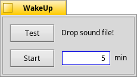

# WakeUp!

WakeUp is an alarm clock that plays a sound set by the user.
The application has a very simple and easy to use interface.

### License:
You are free to re-use, modify or do whatever you want with this code.  However, if the algorithm  is used in one of your applications, the author (Jonathan Villemure) wants credit.
